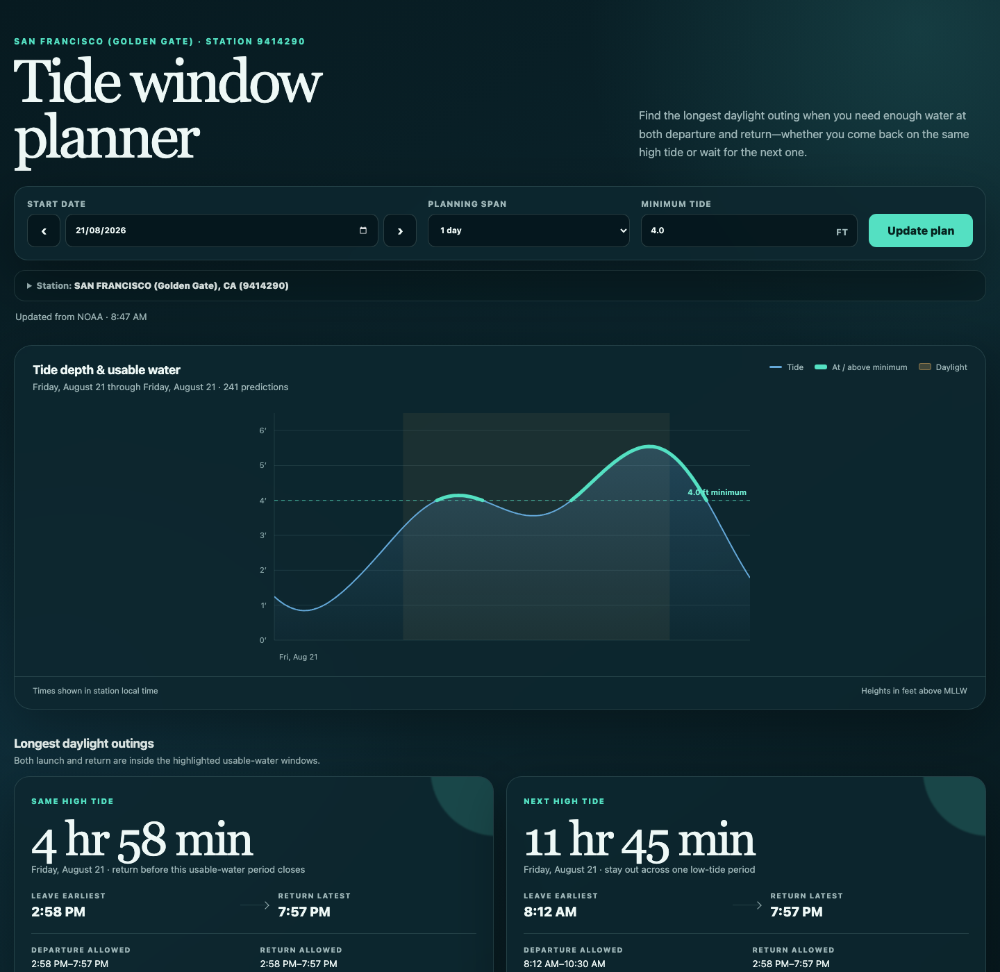

# Signal K Tide Window Planner

A dependency-free Signal K standalone webapp for planning tide-limited daylight outings. It uses NOAA six-minute tide predictions, highlights water at or above a configurable minimum, and calculates the longest outing where departure and return are possible:

- within the same above-threshold high-tide period; or
- across one low-tide period, returning on the next high tide.

Each result includes the full allowed departure and return ranges and the earliest-departure/latest-return combination that gives the maximum outing.



The station picker uses NOAA reference stations because they provide the six-minute prediction series required by the planner. Subordinate stations may be geographically closer, but NOAA provides only high/low predictions for them.

## Station selection

Open **Station** in the webapp to choose a NOAA tide-prediction station in any of three ways:

1. If no choice is saved, the app uses the current Signal K vessel position—or browser geolocation as a fallback—to select the nearest compatible prediction station. You can repeat this at any time with **Use nearest station**.
2. Search the distance-sorted station dropdown by name, state, or station ID.
3. Enter a NOAA station ID directly.

The webapp saves the selected station in browser `localStorage`. If location is unavailable and the browser has no saved choice, the station picker opens for manual selection; there is no hardcoded station.

## Install in Signal K

This project is not published to the npm registry. The package is marked `"private": true` to prevent accidental publication.

Install it directly from GitHub on a Signal K host whose SSH key has access to the private repository. From the Signal K configuration directory (normally `~/.signalk`):

```sh
npm install git+ssh://git@github.com/zph/signalk-tidal-planner.git
```

This uses npm only as Signal K's package installer; it clones the code from the private Git repository and does not contact the npm registry for this app. To update the installed copy to the latest `main` branch:

```sh
npm install git+ssh://git@github.com/zph/signalk-tidal-planner.git#main
```

Restart Signal K. **Tide Window Planner** appears in the Webapps list and is mounted at:

```text
http://SIGNALK_SERVER:3000/signalk-tidal-planner/
```

The `signalk-webapp` keyword and `signalk.displayName` declaration in `package.json` are what Signal K uses to discover and display the app. There is no server-side plugin code or frontend build step.

## Standalone development

No package installation or frontend build is required:

```sh
make
```

Open <http://localhost:8000>. Use `make PORT=9000` to choose another port. Standalone mode uses browser geolocation because no Signal K vessel-position API is present.

## Data and interpretation

- Predictions come from the [NOAA CO-OPS Data API](https://api.tidesandcurrents.noaa.gov/api/prod/).
- The station directory comes from the [NOAA CO-OPS Metadata API](https://api.tidesandcurrents.noaa.gov/mdapi/prod/).
- Tide height is in feet relative to Mean Lower Low Water (MLLW).
- “Daylight” means sunrise through sunset at the selected station.
- The entire “next high tide” outing must fit in one daylight period and cross exactly one below-threshold tide period.

This is a planning aid, not a clearance guarantee. Weather, river flow, waves, vessel draft, chart datum, and local conditions can change usable clearance.

## License

[MIT](LICENSE)
